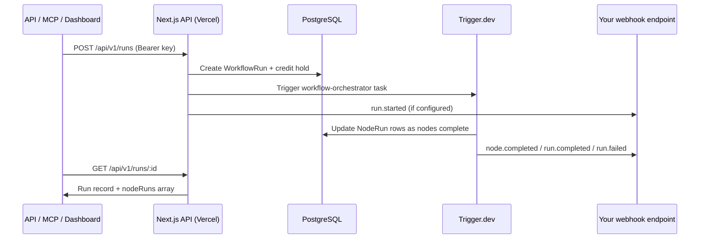

## System overview

The canvas, REST API, and MCP server all reach the same execution path: create a `WorkflowRun` row, place a credit hold, and trigger the `workflow-orchestrator` Trigger.dev task. There is no separate execution engine per entry point.

---

## Components

<CardGroup cols={2}>
  <Card title="Canvas UI" icon="browser">
    React Flow editor, Playground tab, Clerk auth, and run history panel. Lives in `galaxy-temp-frontend`.
  </Card>
  <Card title="HTTP API" icon="server">
    Session routes (`/api/*`) and public v1 routes (`/api/v1/*`). Lives in `galaxy-temp-backend/app/api`.
  </Card>
  <Card title="Shared node definitions" icon="cubes">
    `@galaxy/shared` — Zod schemas, credit base costs, and handle types consumed by both repos.
  </Card>
  <Card title="Orchestrator" icon="diagram-project">
    `trigger/workflowOrchestrator.ts` — topological DAG execution, Trigger.dev waitpoints, inline vs task dispatch.
  </Card>
  <Card title="Node tasks" icon="bolt">
    `trigger/*Task.ts` — GPT Image 2, Kling v3, Gemini, OpenRouter, and FFmpeg utility tasks.
  </Card>
  <Card title="Webhooks" icon="webhook">
    `lib/webhooks.ts` + `trigger/emitWebhookTask.ts` — signed outbound POSTs with 3-retry exponential backoff.
  </Card>
  <Card title="Credits" icon="coins">
    `lib/credits.ts` — microcredit ledger: initial grant, hold on run start, reconcile on finish.
  </Card>
  <Card title="MCP server" icon="plug">
    `scripts/mcp-server.ts` — StdIO adapter using the same Prisma + Trigger.dev calls as the REST API.
  </Card>
</CardGroup>

---

## How the orchestrator works

The orchestrator is a **single Trigger.dev task** per run — it does not split into per-layer batches.

<Steps>
  <Step title="Load the graph">
    Load the workflow's `nodes` and `edges` from the database and compute topological execution order.
  </Step>
  <Step title="Filter by scope">
    If scope is `partial` or `single`, filter to target `nodeIds` plus their upstream dependencies.
  </Step>
  <Step title="Walk the sorted list">
    For each node in order:
    - **Lightweight nodes** (requestInputs, response) — resolved inline. No child task is spawned.
    - **Heavy nodes** (GPT Image 2, Kling v3, Gemini, OpenRouter, FFmpeg tasks) — dispatched as child Trigger.dev tasks. The orchestrator waits on a `waitpoint` token that the child resolves when it finishes.
  </Step>
  <Step title="Emit events">
    After each node, fire a `node.completed` webhook event (if configured).
  </Step>
  <Step title="Reconcile and close">
    After all nodes finish, reconcile credits and emit `run.completed` or `run.failed`.
  </Step>
</Steps>

Because all runs share a single `WorkflowRun` row, `GET /api/v1/runs/:id` always returns consistent state regardless of who is polling.

---

## Authentication split

There are two independent auth systems:

| Route prefix | Auth method |
| --- | --- |
| `/api/v1/*` | Bearer API key — Unkey or local SHA-256 hash |
| `/api/workflows/*`, `/api/keys/*`, `/api/credits/*` | Clerk session cookie from the frontend |

Do not send an API key to Clerk-only routes or a session cookie to `/api/v1` routes.

---

## Default workflow scaffold

`POST /api/v1/workflows` always creates the same starting graph:

- A `requestInputs` node with one text field (`field_text_default`)
- A `response` node with an empty `results` list
- No edges

You add nodes and edges through the canvas or by `PUT`-ing a full graph JSON to `PUT /api/v1/workflows/{id}`.

---

## Data model

| Table | Key fields |
| --- | --- |
| `Workflow` | `nodes` (JSON), `edges` (JSON), `webhookUrl`, `webhookSecret` |
| `WorkflowRun` | `scope`, `status`, `inputValues`, `orchestratorRunId` |
| `NodeRun` | `nodeId`, `inputs`, `output`, `error`, `creditCost`, `providerUsed`, `status` |

`GET /api/v1/runs/:id` returns a subset of `NodeRun` fields. Internal fields like `providerAttempts` and raw execution logs are only accessible through dashboard session routes.
