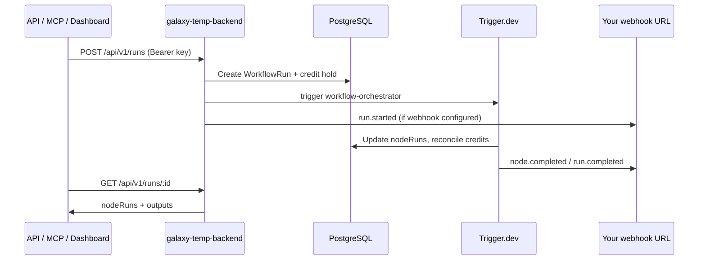

## High-level flow

## Components

| Layer | Location | Role |
| --- | --- | --- |
| Canvas UI | `galaxy-temp-frontend` | React Flow editor, Playground, Clerk auth |
| HTTP API | `galaxy-temp-backend/app/api` | Session routes (`/api/workflows/*`) + public v1 (`/api/v1/*`) |
| Shared node defs | `@galaxy/shared` | Zod schemas, credit `base` costs, handle types |
| Orchestrator | `trigger/workflowOrchestrator.ts` | Topological execution, waitpoints, inline vs Trigger tasks |
| Node tasks | `trigger/*Task.ts` | GPT Image, Kling, FFmpeg utilities, LLM calls |
| Webhooks | `lib/webhooks.ts` + `trigger/emitWebhookTask.ts` | Signed outbound POSTs with retries |
| Credits | `lib/credits.ts` | Microcredit ledger, hold at run start, reconcile at end |
| MCP | `scripts/mcp-server.ts` | StdIO tools; same Prisma + orchestrator as API |

## Coordinator pattern (not layer batching)

Runs use a **single orchestrator task** that walks the DAG in topological order. Heavy nodes trigger child Trigger.dev tasks and **wait** on waitpoint tokens; lightweight nodes (e.g. Request-Inputs wiring) run **inline** inside the orchestrator.

Implications:

- One `workflowRun` row per API/MCP/dashboard execution.
- `nodeRuns` rows are created/updated as nodes finish.
- Failures in a child task mark the node failed and can fail the whole run.

## Authentication split

| Route prefix | Auth |
| --- | --- |
| `/api/v1/*` | Bearer API key (`lib/api-auth.ts` → Unkey or local hash) |
| `/api/workflows/*`, `/api/keys/*`, `/api/credits/balance` (non-v1) | Clerk session (`auth()`) |

Never send your API key to Clerk-only routes or vice versa.

## Default workflow scaffold

`POST /api/v1/workflows` creates:

- `request-inputs` node (`type: requestInputs`) with one `field_text_default` text field.
- `response` node (`type: response`) with empty `results`.
- No edges until you connect them in the UI or via `PUT`.

Same defaults are used by `scripts/mcp-server.ts` `create_workflow`.

## Data model (execution)

- **Workflow** — `nodes` / `edges` JSON, optional `webhookUrl` + `webhookSecret`.
- **WorkflowRun** — `scope`, `status`, `inputValues`, `orchestratorRunId`.
- **NodeRun** — per-node `inputs`, `output`, `error`, `creditCost`, `providerUsed`.

Public `GET /api/v1/runs/:id` returns a subset of node run fields (see OpenAPI `NodeRun` schema).
